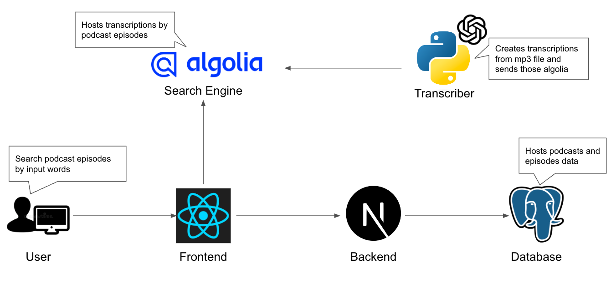

# KoeSagas

<div align="center">
  <h1>Podcast Transcription Search Engine</h1>
  <p>
	<b>A simple and easy to use podcast search engine</b>
  </p>
  <br>
</div>

## About
Have you ever wanted to search for a specific topic in a podcast but didn't want to listen to the whole thing? KoeSagas is a podcast transcription search engine that allows you to search for a specific topic in a podcast and get a list of timestamps where the topic is mentioned.

## Techniques
This library made of:
- Whisper
  - Whisper is a speech recognition engine that uses the [Hugging Face Transformers](https://huggingface.co/transformers/) library to convert speech to text.
- Algolia
  - Algolia is a search engine that allows you to search for a specific topic in a podcast and get a list of timestamps where the topic is mentioned.
- React
  - as a front-end framework
- Next.js
  - as a back-end framework
- PostgreSQL
  - as a database
- Python
  - as a scripting language to run Whisper
- Docker

## System Architecture


## Installation
This section expains how to use this library.

1. Clone this repository.
```
 $ git clone https://github.com/yuta519/koesagas.git
```

2. Create docker image and run containers.
```bash
$ docker-compose build
$ docker-compose up
```

## Usage
Go to the [localhost:3000](http://localhost:3000) and you can see the top page.

## License
Copyright 2023 Yuta Kawamura

Licensed under the Apache License, Version 2.0 (the "License");
you may not use this file except in compliance with the License.
You may obtain a copy of the License at

http://www.apache.org/licenses/LICENSE-2.0

Unless required by applicable law or agreed to in writing, software
distributed under the License is distributed on an "AS IS" BASIS,
WITHOUT WARRANTIES OR CONDITIONS OF ANY KIND, either express or implied.
See the License for the specific language governing permissions and
limitations under the License.
